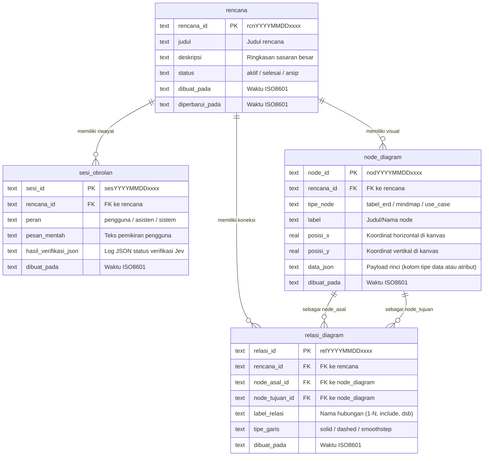

# Rancangan Basis Data: Pencatat & Pengingat Rencana Besar
Dokumen ini mencatat skema relasional, ERD, konvensi ID, dan kamus data sesuai aturan antislop (DB-01 s/d DB-06).

## 1. Konvensi Penamaan & Format ID (DB-04, DB-05)
- Nama tabel dan kolom menggunakan **Bahasa Indonesia**, format `snake_case`, bentuk tunggal.
- Primary Key bernama `<nama_tabel>_id`. Foreign Key merujuk nama tabel tujuan.
- Format ID terstruktur: `<prefix><YYYYMMDD><4_digit_acak>` (contoh: `rcn202610034182`).

| Entitas | Prefix | Contoh ID | Deskripsi |
|---|---|---|---|
| `rencana` | `rcn` | `rcn202610034182` | Rencana besar atau proyek utama pengguna |
| `sesi_obrolan` | `ses` | `ses202610038891` | Riwayat percakapan ide dan pesan instruksi |
| `node_diagram` | `nod` | `nod202610031102` | Node pada kanvas React Flow (ERD, Mindmap, UseCase) |
| `relasi_diagram` | `rel` | `rel202610037721` | Garis relasi / edge antara dua node |

---

## 2. Diagram Relasi Entitas (ERD)



---

## 3. Skema DDL SQLite & Indeks (DB-02, DB-06)

```sql
-- Tabel: rencana
CREATE TABLE IF NOT EXISTS rencana (
    rencana_id TEXT PRIMARY KEY,
    judul TEXT NOT NULL,
    deskripsi TEXT,
    status TEXT NOT NULL DEFAULT 'aktif',
    dibuat_pada TEXT NOT NULL,
    diperbarui_pada TEXT NOT NULL
);

-- Tabel: sesi_obrolan
CREATE TABLE IF NOT EXISTS sesi_obrolan (
    sesi_id TEXT PRIMARY KEY,
    rencana_id TEXT NOT NULL,
    peran TEXT NOT NULL,
    pesan_mentah TEXT NOT NULL,
    hasil_verifikasi_json TEXT,
    dibuat_pada TEXT NOT NULL,
    FOREIGN KEY (rencana_id) REFERENCES rencana (rencana_id) ON DELETE CASCADE
);

-- Tabel: node_diagram
CREATE TABLE IF NOT EXISTS node_diagram (
    node_id TEXT PRIMARY KEY,
    rencana_id TEXT NOT NULL,
    tipe_node TEXT NOT NULL,
    label TEXT NOT NULL,
    posisi_x REAL NOT NULL DEFAULT 0.0,
    posisi_y REAL NOT NULL DEFAULT 0.0,
    data_json TEXT NOT NULL DEFAULT '{}',
    dibuat_pada TEXT NOT NULL,
    FOREIGN KEY (rencana_id) REFERENCES rencana (rencana_id) ON DELETE CASCADE
);

-- Tabel: relasi_diagram
CREATE TABLE IF NOT EXISTS relasi_diagram (
    relasi_id TEXT PRIMARY KEY,
    rencana_id TEXT NOT NULL,
    node_asal_id TEXT NOT NULL,
    node_tujuan_id TEXT NOT NULL,
    label_relasi TEXT,
    tipe_garis TEXT NOT NULL DEFAULT 'smoothstep',
    dibuat_pada TEXT NOT NULL,
    FOREIGN KEY (rencana_id) REFERENCES rencana (rencana_id) ON DELETE CASCADE,
    FOREIGN KEY (node_asal_id) REFERENCES node_diagram (node_id) ON DELETE CASCADE,
    FOREIGN KEY (node_tujuan_id) REFERENCES node_diagram (node_id) ON DELETE CASCADE
);

-- Pengindeksan untuk efisiensi kueri (DB-06)
CREATE INDEX IF NOT EXISTS idx_sesi_rencana ON sesi_obrolan (rencana_id);
CREATE INDEX IF NOT EXISTS idx_node_rencana ON node_diagram (rencana_id);
CREATE INDEX IF NOT EXISTS idx_relasi_rencana ON relasi_diagram (rencana_id);
CREATE INDEX IF NOT EXISTS idx_relasi_asal ON relasi_diagram (node_asal_id);
CREATE INDEX IF NOT EXISTS idx_relasi_tujuan ON relasi_diagram (node_tujuan_id);
```
